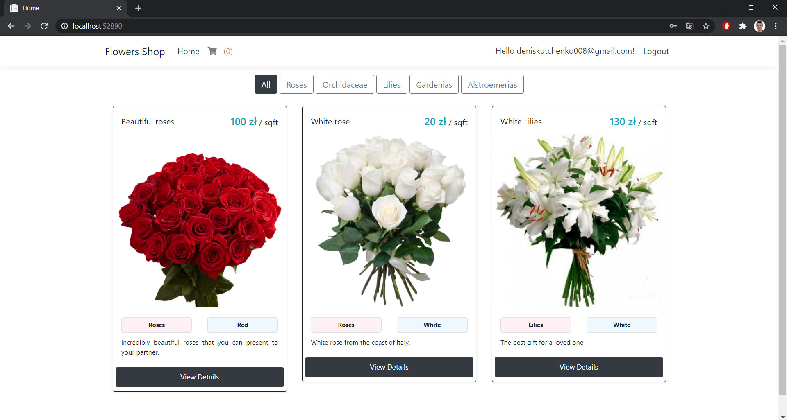
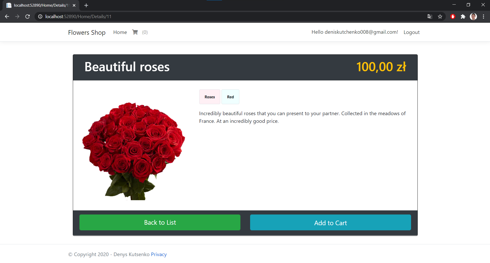
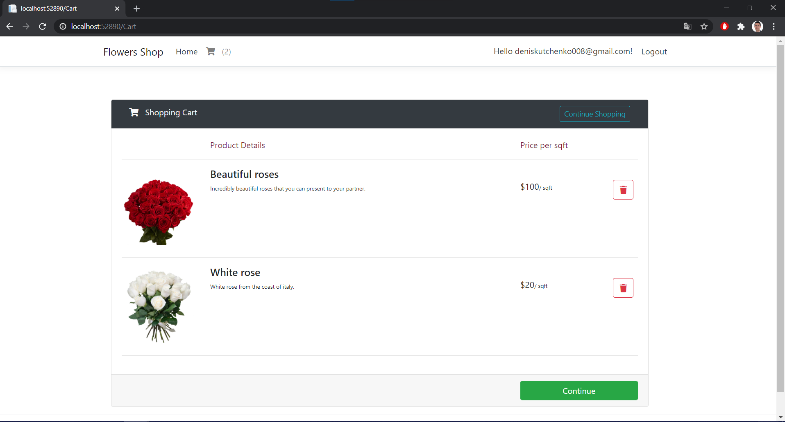
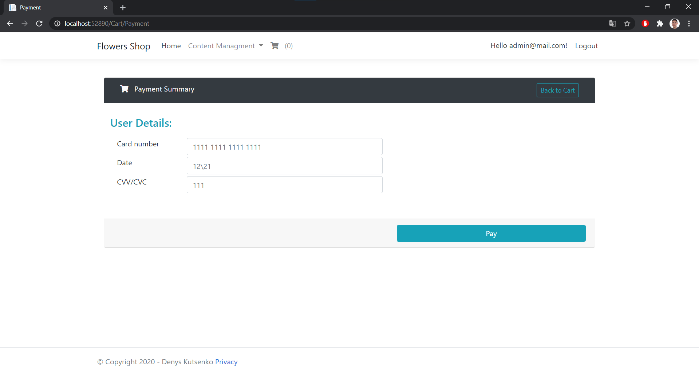
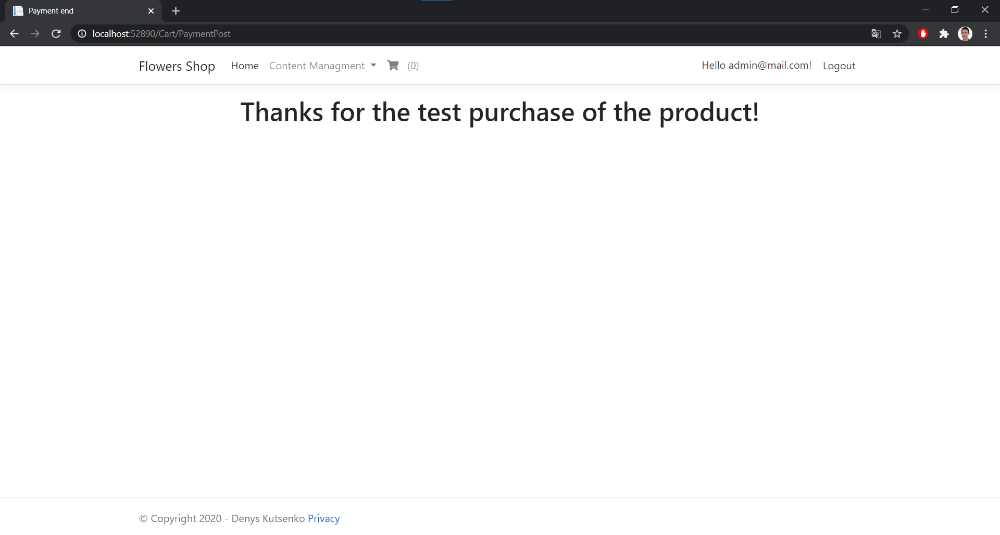
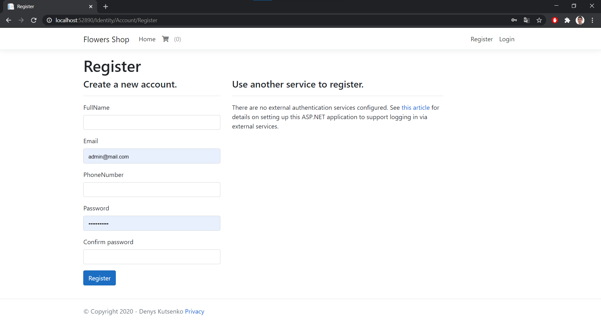
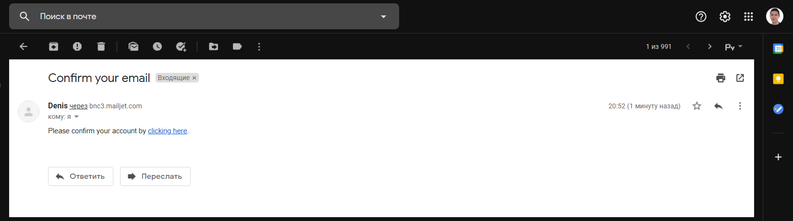
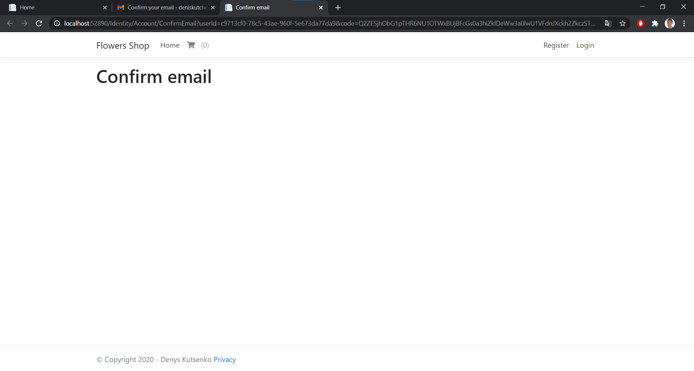
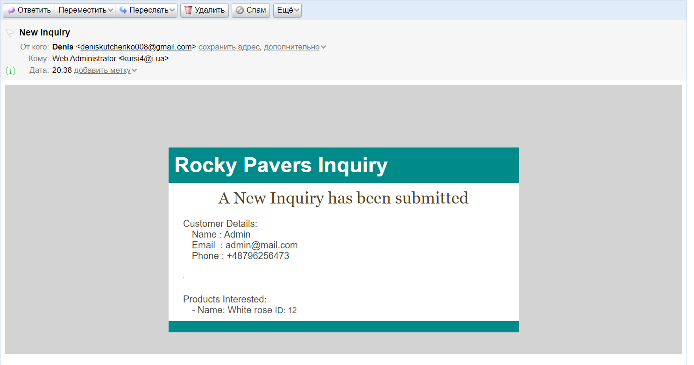

<h1>Flowers shop</h1> 
ASP .NET Core MVC, . Net 5.0, MS SQL Server, Indentity, Entity Framework
MailJet API 

<i>The project works on. Net 5.0, it is necessary to create a database and perform data migration.
There are 2 types of users, admins and regular users in the project. Admins can edit the content of pages, users can only buy goods.During registration and purchase of goods, an e-mail is automatically sent to the post office.</i>

Main Page:

Description:

Summary:

Payment page:

End of payment:

Admiw View:

Register Page:

Confirm email:

